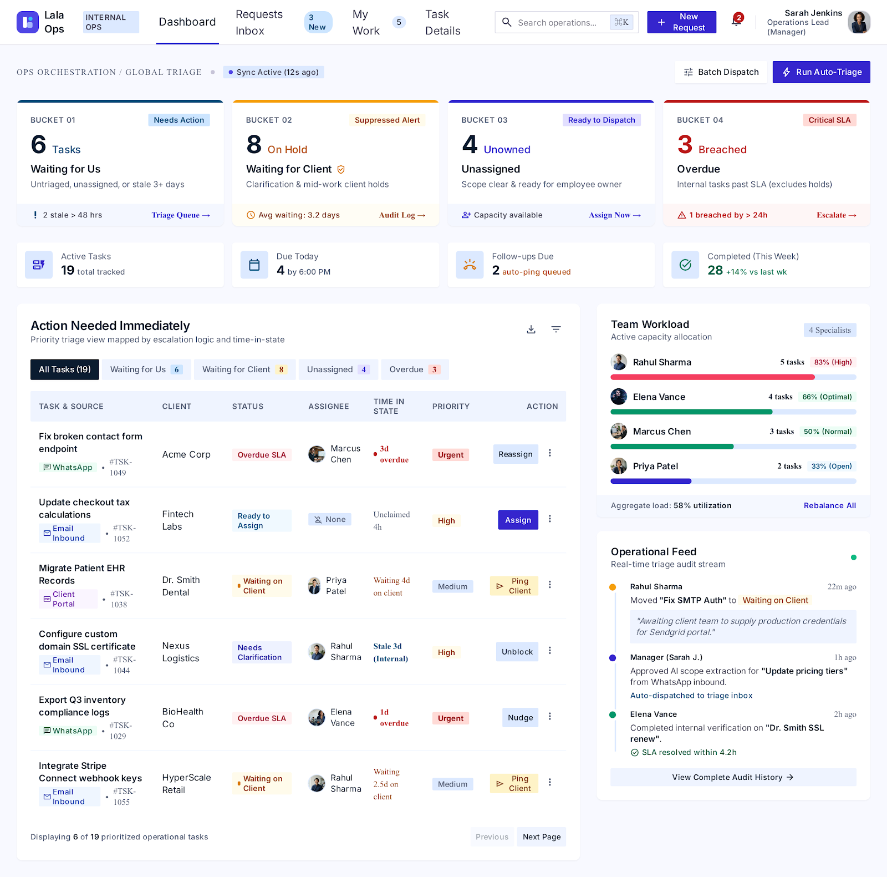
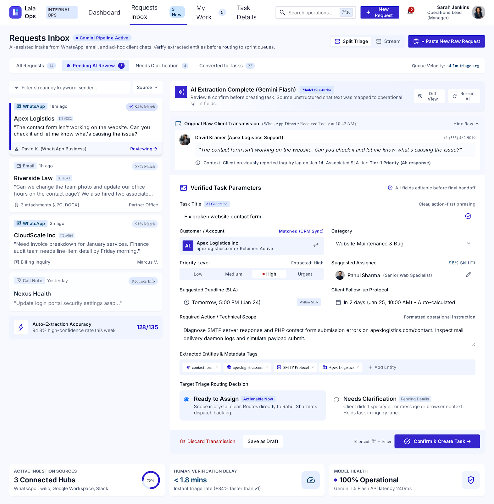
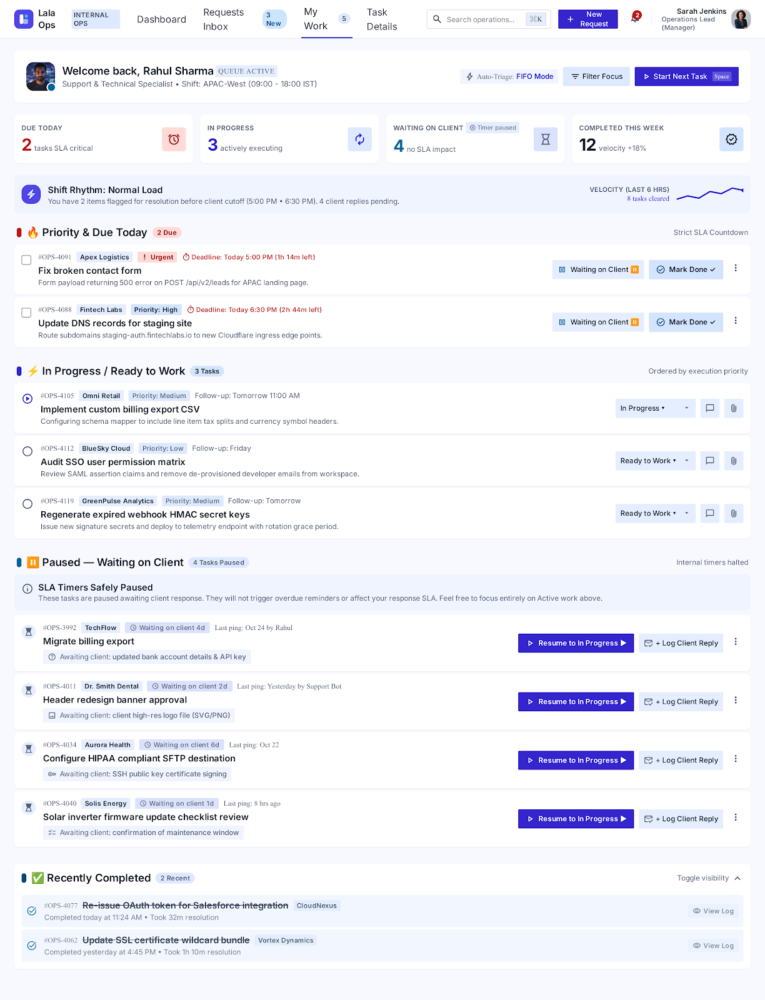
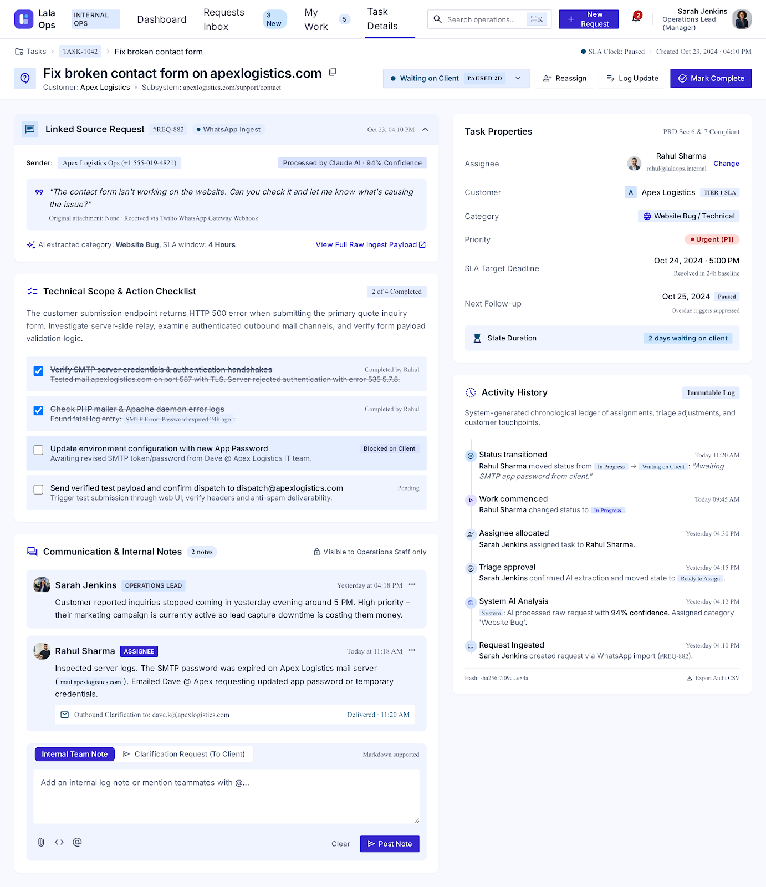

# Lala Ops — Internal Operations & Triage Suite

<div align="center">

[](https://vercel.com/new/clone?repository-url=https%3A%2F%2Fgithub.com%2Frxra01%2Flala-ops)
[](docs/lala-ops-technical-resource.md)
[](css/styles.css)
[](LICENSE)

<br />

**An intelligent internal operations management, AI triage, and task orchestration system built for Lala Tech LLC.**  
Engineered from the ground up to follow the technical specification in [`docs/lala-ops-technical-resource.md`](docs/lala-ops-technical-resource.md) and the Stitch UI/UX design suite.

[Deploy to Vercel](https://vercel.com/new/clone?repository-url=https%3A%2F%2Fgithub.com%2Frxra01%2Flala-ops) · [Features](#-core-features) · [The 4 Visibility Buckets](#-the-4-core-visibility-buckets) · [Quick Start](#-quick-start) · [Hero Scenario](#-end-to-end-hero-scenario)

</div>

---

## 📸 Interface Showcase

| Manager Operations Dashboard | Requests Inbox & AI Review |
| :---: | :---: |
|  |  |

| Employee "My Work" Queue | Unified Task Details & Activity History |
| :---: | :---: |
|  |  |

---

## 🌟 The Problem & The Solution

Client requests arrive continuously across informal communication channels—**WhatsApp, email, and ad-hoc chat**—and frequently get tracked in fragile spreadsheets. This creates three critical points of operational failure:

1. **Requests get forgotten** because they live in chat threads, not a system.
2. **Ownership is unclear** — no one knows who is supposed to be doing what.
3. **Follow-ups stall silently** because nothing proactively resurfaces stale work.

**Lala Ops** solves this by collapsing the effort of task conversion to **"paste and confirm"** via an automated AI extraction engine. Humans remain in control to verify extracted fields before committing tasks, and the system explicitly guarantees that **"waiting on the client" is never confused with "forgotten by us."**

---

## 🚀 Quick Start

### 1. One-Click Cloud Deploy (Vercel)
Deploy your own live production instance directly to Vercel:

[](https://vercel.com/new/clone?repository-url=https%3A%2F%2Fgithub.com%2Frxra01%2Flala-ops)

*No build step or server configuration required. Vercel automatically deploys the static suite in under 15 seconds.*

### 2. Run Locally (Zero-Dependency PowerShell Server)

Clone the repository and run the built-in static server:

```powershell
git clone https://github.com/rxra01/lala-ops.git
cd lala-ops
powershell -ExecutionPolicy Bypass -File .\serve.ps1 -Port 3000
```

Open your browser at **`http://localhost:3000/`**.

### 3. Direct Browser Launch
You can also open [`index.html`](index.html) directly in any modern browser without running a server.

---

## 🧭 The 4 Core Visibility Buckets

Per PRD Section 7, 9, and 10, distinguishing client-side pauses from internal negligence is the primary priority:

```
┌────────────────────────────────────────────────────────────────────────┐
│                        4 CORE VISIBILITY BUCKETS                       │
├────────────────────────────────────────────────────────────────────────┤
│ 1. Waiting for Us      → new_request + ready_to_assign +               │
│                          stale in_progress (> 3 days without update)   │
│                                                                        │
│ 2. Waiting for Client  → needs_clarification + waiting_on_client       │
│                          ★ EXPLICITLY SUPPRESSED FROM OVERDUE ALERTS   │
│                          ★ Tracks elapsed pause timer (e.g. Paused 2d) │
│                                                                        │
│ 3. Unassigned          → Any task where isUnassigned == true           │
│                                                                        │
│ 4. Overdue             → deadline < now AND status != 'done' AND       │
│                          status NOT IN (needs_clarification,           │
│                                         waiting_on_client)             │
└────────────────────────────────────────────────────────────────────────┘
```

---

## ⚡ Core Features

### 1. Manager Operations Dashboard
- **Real-Time Visibility**: Live computed metrics for all 4 visibility buckets.
- **Filterable Triage Stream**: Filter tasks by bucket, status, or keyword search.
- **Workload by Employee**: Visual workload distribution bars to prevent burnout.
- **Priority Distribution**: Instant breakdown of urgent, high, medium, and low tasks.
- **1-Click Hero Scenario Runner**: Header button **`Run Hero Demo Beat`** automatically triggers the end-to-end contact form triage journey.

### 2. Requests Inbox & AI Extraction Pipeline
- **Split Triage Workspace**: Master-detail view pairing raw incoming messages with structured entity inspectors.
- **AI Extraction Schema (PRD §8)**: Extracts `title`, `customer`, `category`, `priority`, `deadline`, `followUpDate`, `suggestedAssigneeName`, and `confidence`.
- **Human-in-the-Loop Review**: Editable review modal allows full verification and modification before persisting.
- **Fallback Guarantee**: Always provides a pre-filled manual entry fallback form so outages never block operational flow.

### 3. Employee "My Work" Queue
- **Personalized Workspace**: Tailored focus queues for **Rahul Sharma** (*Due Today*, *In Progress*, *Waiting on Client*, *Recently Completed*).
- **Calm Amber Client Hold**: *Waiting on Client* tasks are displayed in distinct calm amber styling with a paused SLA clock—eliminating false alarms.
- **Inline Quick Status Toggles**: 1-click status transitions (*Wait on Client*, *Resume Work*, *Mark Done*) directly on task cards without navigating away.

### 4. Unified Task Details & Activity History
- **Complete Task Context**: Centralized hub bringing together core parameters, priority pickers, status transitions, and linked source messages.
- **Comments & Clarification Thread**: Records questions asked of clients, credentials received, and progress updates.
- **Immutable Chronological Audit Log**: Pre-rendered human-readable audit sentences ("Sarah Jenkins created task", "Rahul moved to Waiting on Client: SLA alert paused", "Rahul resumed work").

### 5. Multi-Role Profile Switching
Switch active users instantly via the top-right profile avatar:
- **Sarah Jenkins** (`user-mgr-1`) — Manager (Full triage, dispatch, dashboard metrics).
- **Rahul Sharma** (`user-emp-1`) — Employee (Support Specialist, My Work queue, inline status controls).

---

## 🎬 End-to-End Hero Scenario

The hero demo journey specified in **PRD Section 18** can be tested in 1 click:

1. Click **`Run Hero Demo Beat`** in the dashboard header (or click **`+ Intake Request`** → select preset **`Hero: Contact Form (Apex Logistics)`**).
2. The AI extraction pipeline processes the raw text:
   - **Input**: *"The contact form isn't working on the website. Can you check it and let me know what's causing the issue?"*
   - **Extracted Output**: Title: *"Fix broken contact form on apexlogistics.com"*, Customer: *Apex Logistics*, Category: *Website*, Priority: *High*, Assignee: *Rahul Sharma*.
3. Click **`Confirm & Create Task`** in the review modal.
4. Switch role to **Rahul Sharma** (top-right menu).
5. In **My Work**, click **`Wait on Client`** and enter note: *"Need client SMTP credentials"*.
6. Switch back to **Sarah Jenkins (Manager)**:
   - Notice the **Waiting for Client** bucket incremented.
   - The task is **NOT** marked overdue, and its SLA clock is paused!
7. Open the task in **Task Details** to see the chronological timeline record.
8. Transition status to **`In Progress`** (credentials received) → **`Done`** (completed).
9. Observe live dashboard metrics updating immediately.

---

## 🏛️ Project Architecture

```
lala-ops/
├── index.html         # Main SPA shell: Navigation, 5 core views, modals, command palette (⌘K)
├── css/
│   └── styles.css     # Ops Core Design System tokens, status badges, typography, micro-animations
├── js/
│   ├── db.js          # Reactive document store (users, requests, tasks, comments, activityLog, notifications)
│   ├── ai.js          # AI extraction client (Gemini target schema, semantic parser, manual fallback)
│   └── app.js         # View router, role switching, dashboard calculations, demo runners
├── assets/            # Vector logo SVG, manager avatars, and graphics
├── docs/
│   ├── lala-ops-technical-resource.md # Technical PRD & specifications
│   └── screenshots/   # UI interface screenshots
├── serve.ps1          # Zero-dependency PowerShell HTTP server (Port 3000)
├── README.md          # Comprehensive documentation & setup guide
└── .gitignore
```

---

## 📋 PRD Acceptance Criteria Compliance

| Criterion | PRD Pass Condition | Status |
|---|---|:---:|
| **Request** | User enters messy operational request as free text | ✅ Pass |
| **AI** | System returns structured, useful extracted fields matching PRD schema | ✅ Pass |
| **Review** | User can edit any AI-suggested field before confirming | ✅ Pass |
| **Task** | Persisted task record created and linked to originating request | ✅ Pass |
| **Assignment** | Manager can assign task to an employee once ready | ✅ Pass |
| **Employee** | Employee sees task in My Work queue and updates status | ✅ Pass |
| **Follow-up** | Follow-up date set and in-app reminder notification generated | ✅ Pass |
| **Waiting-on-Client Accuracy** | Client-waiting tasks never appear in Overdue bucket or trigger stale alerts | ✅ Pass |
| **Visibility** | Manager dashboard reflects current state across the 4 buckets | ✅ Pass |
| **Completion** | Employee can mark task Completed | ✅ Pass |
| **History** | Activity log shows accurate, ordered human-readable event sequence | ✅ Pass |
| **Dashboard** | Counts update dynamically in real time after every action | ✅ Pass |

---

## 📄 License

Internal Operations Suite — Built for Lala Tech LLC.  
Repository: [https://github.com/rxra01/lala-ops](https://github.com/rxra01/lala-ops)
