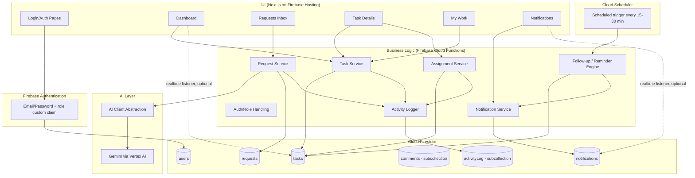
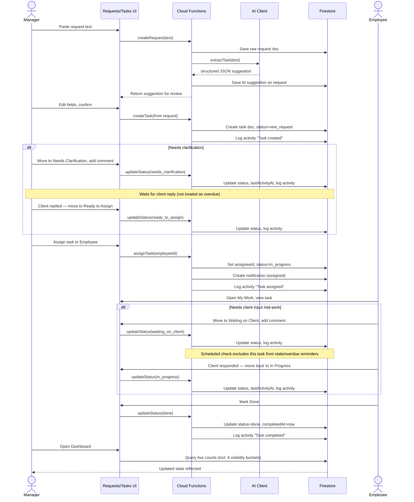
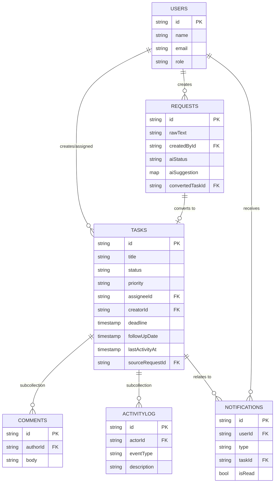
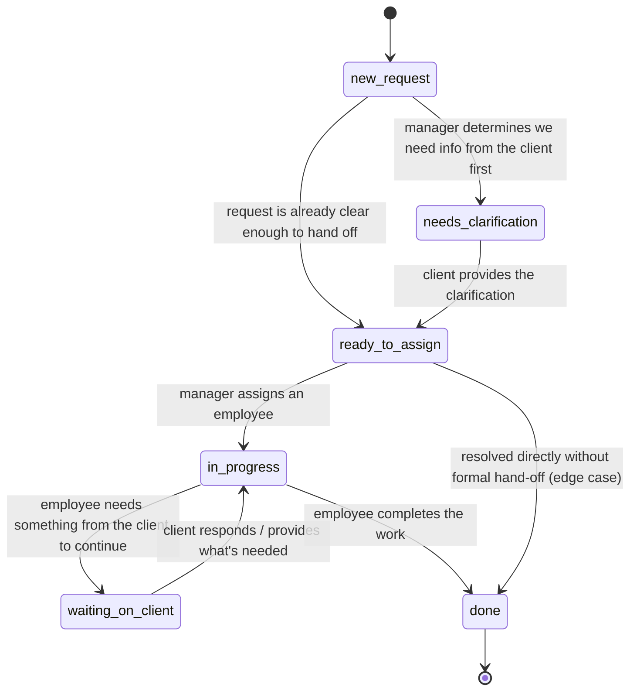

# Lala Ops — Technical Product Resource Document (Demo/MVP)

**Prepared for:** Lala Tech LLC
**Document type:** Engineering-ready technical resource for building the Lala Ops demo
**Scope:** Functional demo/MVP, not enterprise SaaS

---

## 1. Product Interpretation

### The client's actual problem
Client requests arrive through WhatsApp, email, and casual conversation, and get tracked (if at all) in spreadsheets. This causes three concrete failures:
- Requests get forgotten because they live in a chat thread, not a system.
- Ownership is unclear — no one knows who is supposed to be doing what.
- Follow-ups don't happen because nothing proactively resurfaces stale work.

### The proposed Lala Ops solution
A single internal tool where any incoming request is converted into a structured, owned, trackable task. AI removes the friction of that conversion — a manager pastes in the messy request text and gets back a structured suggestion instead of manually filling in a form. Humans still decide what's correct.

### Primary users
- **Manager (1–2 people):** creates requests, assigns tasks, monitors the business.
- **Employee (~8–10 people):** works assigned tasks, updates status, adds notes.

### The core workflow
```
REQUEST → CLARIFY (if needed) → READY → ASSIGN → WORK ⇄ WAIT ON CLIENT → COMPLETE
```
Requests no longer move straight from "created" to "assigned." Some need clarification before they're even ready to hand to someone, and work already in progress sometimes has to pause while the client provides something — that pause is tracked explicitly so it never looks like a team member simply forgot about it.

### Why AI is useful here
The bottleneck isn't task-tracking software — it's the effort of turning a one-line WhatsApp message into a structured task (title, category, priority, deadline, assignee). AI collapses that effort to "paste and confirm," which is the only way a small team will actually adopt the habit of logging requests immediately instead of "later."

### Why follow-up reminders matter
The single most common failure mode described by the client is silent stalling — a task is created, someone means to check on it, and it quietly falls off everyone's radar. Follow-up reminders are the flagship automation because they directly prevent that pain — but as of the client's latest feedback, correctly **distinguishing "waiting on the client" from "forgotten by us"** is the higher-priority problem to solve first (Section 7, Section 9): a task that's paused because the client hasn't replied is a completely different situation from one an employee has genuinely dropped, and the system must never conflate the two.

---

## 2. Demo Scope

> **Update (client change request):** the client has asked us to prioritize the request lifecycle (clarification / ready-to-assign / waiting-on-client) and the manager visibility views over the "additional automation" items previously listed as optional. Scope below reflects that.

### MUST HAVE
| # | Feature | Notes |
|---|---|---|
| 1 | Authentication/login | Simple email+password, session-based |
| 2 | Manager & Employee roles | Two roles only |
| 3 | Dashboard | Manager-facing, real DB data, with the four visibility buckets below |
| 4 | Manual request creation | Paste/type text |
| 5 | AI request understanding | LLM extraction to structured JSON |
| 6 | AI extraction review/edit | Editable form before confirm |
| 7 | Task creation | Persisted, linked to source request |
| 8 | Task assignment | Manager assigns to employee, only once a task is Ready to Assign |
| 9 | Task status management | New Request → Needs Clarification → Ready to Assign → In Progress ⇄ Waiting on Client → Done |
| 10 | Task details | Single unified view |
| 11 | Employee "My Work" | Personal queue — excludes tasks Waiting on Client from feeling "overdue" |
| 12 | Follow-up date | Field on task |
| 13 | Follow-up reminders | Scheduled check, in-app notification, **suppressed while a task is Waiting on Client** |
| 14 | Comments/notes | Per task — used to record what clarification was requested/received |
| 15 | Activity history | Immutable timeline |
| 16 | Basic operational metrics | Dashboard counts, not vanity charts |
| 17 | Realistic demo/sample data | Seeded, including examples in each new status |
| 18 | Manager visibility views | Quick filters/counts for: **Waiting for us · Waiting for client · Unassigned · Overdue** (Section 10) |

### NICE TO HAVE (only if free — explicitly deprioritized per client's latest request)
- Simple automation rule configuration (e.g., adjustable "days without update" threshold)
- Basic workload visualization (tasks-per-employee bar)
- Additional dashboard filtering (by employee, priority, category)
- Additional notification types

### DO NOT BUILD
WhatsApp/email integration · Full CRM/ERP · Complex workflow builder · Advanced reporting · Complex permissions hierarchy · Multi-tenancy beyond demo needs · Autonomous AI agents · Full chat system · Mobile app · Microservices · Anything not on the core path

---

## 3. Recommended Demo Tech Stack (Firebase-based)

| Layer | Choice | Why |
|---|---|---|
| Frontend | **Next.js (React, App Router, TypeScript)** | Server + client components, fast to build screens; deploys cleanly to Firebase Hosting (via App Hosting or a Cloud Functions/Cloud Run target) |
| Backend | **Firebase Cloud Functions (2nd gen)** — callable functions / HTTPS endpoints | No separate server to manage; scales to zero between the ~10 users' requests |
| Database | **Cloud Firestore** (NoSQL, document-based) | Native fit with Firebase Auth + Functions, real-time listeners are a natural fit for notifications/dashboard, generous free tier at this scale |
| Auth | **Firebase Authentication** (email/password) with a custom `role` claim (Manager/Employee) | Built-in, minimal setup, integrates directly with Firestore Security Rules for enforcement |
| AI provider | **Gemini via the Firebase AI Logic / Vertex AI SDK** (Gemini Flash), accessed through a thin `aiClient` abstraction in a Cloud Function | Same project/billing surface as the rest of the stack; keep the interface swappable |
| Styling/UI | **Tailwind CSS + shadcn/ui** | Fast to build a clean, professional look without custom design system work |
| Reminders/automation | **Cloud Scheduler → Pub/Sub-triggered Cloud Function**, running every 15–30 min | Native Firebase scheduling primitive; no external queue/worker needed |
| Hosting | **Firebase Hosting** (frontend) + **Cloud Functions** (backend/AI/cron) | Single Firebase project covers hosting, auth, DB, functions, and scheduling — one console, one deploy pipeline |

This stack keeps everything inside one Firebase project — no separate database provider, ORM, or cron service to wire up — which is appropriate for a ~10–12 person internal tool and a fast demo build.

> **Note:** Firestore is NoSQL/document-based rather than relational. Section 6 below is written for Firestore collections/documents instead of SQL tables — read counts and denormalization are called out where they matter.

---

## 4. High-Level Architecture



**Key separation:** the frontend does not write to Firestore directly for anything that must be validated or trigger side effects (task creation, assignment, status change) — those go through callable Cloud Functions, which are the only place server-side validation, activity logging, and notification creation happen. Firestore Security Rules act as a second line of defense (Section 16), and are also what makes safe **direct read** access from the client viable — e.g., the dashboard and My Work screens can use real-time `onSnapshot` listeners straight against Firestore for a live-updating feel, since those are reads gated by rules rather than writes. The AI layer is isolated behind a single `aiClient.extractTask(text)` function inside its Cloud Function so the provider can be swapped without touching callers.

---

## 5. Core User Journeys

### Journey 1 — Create request
Open Requests → enter messy request text → submit → AI processes → extracted fields appear for review.

### Journey 2 — Review and create task
Review AI output → edit any field → confirm → task record created in `new_request` status, linked to the source request.

### Journey 3 — Clarify (new)
Manager reviews a `new_request` task and decides it isn't actionable yet → moves it to `needs_clarification` and adds a comment noting what's being asked of the client → task sits visible in the "Waiting for us" / "Waiting for client" views (Section 10) rather than anyone's task list → once the client responds, manager adds a comment with the answer and moves it to `ready_to_assign`.

### Journey 4 — Assign
Manager opens a `ready_to_assign` task → selects employee from dropdown → assigns → status moves to `in_progress` → employee gets an in-app notification.

### Journey 5 — Employee execution
Employee opens My Work → opens assigned task → updates status/adds a comment as work progresses → eventually marks `done`.

### Journey 6 — Waiting on client mid-work (new)
While working an `in_progress` task, the employee realizes they need something from the client (a screenshot, a decision, access credentials) → moves the task to `waiting_on_client` and logs a comment on what's needed → the task **stops counting toward "stale/overdue"** for that employee → once the client responds, the employee (or manager) moves it back to `in_progress`, which resumes normal follow-up/stale tracking.

### Journey 7 — Follow-up
Follow-up date is set (manually or AI-suggested) → task sits pending → a scheduled check detects the date is due/approaching **only if the task is not `waiting_on_client`** → reminder notification is created for the responsible person.

### Journey 8 — Manager visibility
Manager opens dashboard → sees four buckets — Waiting for us, Waiting for client, Unassigned, Overdue — plus workload by employee and completed work, all computed from live DB state.

### Primary sequence diagram (request → completion, including clarification)



---

## 6. Database Design (Cloud Firestore)

Firestore is document-based, not relational — the model below uses top-level collections plus two subcollections, and leans on denormalization (storing a few redundant fields, like assignee name) where it saves an extra read on list screens.

### Collections
- **`users`** — managers and employees (doc ID = Firebase Auth UID)
- **`requests`** — raw incoming text + AI suggestion
- **`tasks`** — the structured, trackable unit of work
  - **`tasks/{taskId}/comments`** (subcollection) — notes on a task
  - **`tasks/{taskId}/activityLog`** (subcollection) — immutable event history for that task
- **`notifications`** — in-app alerts (top-level, queried by recipient)

A separate `followUps` collection is **not** needed: follow-up date and last-activity timestamp live directly on the `tasks` document, since a task has at most one active follow-up at a time and its history is already captured by `activityLog`.

Activity log is modeled as a **subcollection of `tasks`** (rather than top-level) because it's almost always read scoped to one task (the task detail timeline) — this avoids a composite index and keeps reads cheap. Request-level events (e.g. "AI processed") are written to the `requests` document's own small embedded array instead, since a request has very few lifecycle events.

### Document shapes

**`users/{userId}`**
| Field | Type | Required | Notes |
|---|---|---|---|
| name | string | yes | |
| email | string | yes | mirrors Firebase Auth email |
| role | string (`"manager"` \| `"employee"`) | yes | also set as a custom claim on the Auth user for Security Rules |
| createdAt | Timestamp | yes | |

**`requests/{requestId}`**
| Field | Type | Required | Notes |
|---|---|---|---|
| rawText | string | yes | original pasted message |
| createdById | string | yes | ref → `users/{id}` |
| createdByName | string | yes | denormalized, avoids a join for list views |
| aiStatus | string (`pending`\|`processed`\|`failed`) | yes | |
| aiSuggestion | map | no | structured suggestion object (Section 8 schema) |
| aiConfidence | number | no | |
| convertedTaskId | string \| null | no | set once confirmed into a task |
| createdAt | Timestamp | yes | |

**`tasks/{taskId}`**
| Field | Type | Required | Notes |
|---|---|---|---|
| title | string | yes | |
| description | string | no | |
| customer | string \| null | no | |
| category | string | no | Website / Billing / Technical / General / Other |
| priority | string (`low`\|`medium`\|`high`\|`urgent`) | yes | default `medium` |
| status | string (`new_request`\|`needs_clarification`\|`ready_to_assign`\|`in_progress`\|`waiting_on_client`\|`done`) | yes | default `new_request` — see Section 7 for transitions |
| assigneeId | string \| null | no | ref → `users/{id}`; only set from `ready_to_assign` onward |
| assigneeName | string \| null | no | denormalized for list/board views |
| isUnassigned | boolean | yes | kept in sync with `assigneeId == null`; lets the "Unassigned" dashboard view use a simple equality query |
| creatorId | string | yes | ref → `users/{id}` |
| deadline | Timestamp \| null | no | |
| followUpDate | Timestamp \| null | no | |
| lastActivityAt | Timestamp | yes | updated on any change; drives "no update" rule — **not advanced while status is `waiting_on_client`** beyond the transition itself |
| waitingOnClientSince | Timestamp \| null | no | set when status enters `waiting_on_client`, cleared when it leaves; powers the "Waiting for client" dashboard view and how-long-waiting display |
| sourceRequestId | string \| null | no | ref → `requests/{id}` |
| createdAt | Timestamp | yes | |
| updatedAt | Timestamp | yes | |
| completedAt | Timestamp \| null | no | |

**`tasks/{taskId}/comments/{commentId}`**
| Field | Type | Required | Notes |
|---|---|---|---|
| authorId | string | yes | ref → `users/{id}` |
| authorName | string | yes | denormalized |
| body | string | yes | |
| createdAt | Timestamp | yes | |

**`notifications/{notificationId}`**
| Field | Type | Required | Notes |
|---|---|---|---|
| userId | string | yes | recipient, ref → `users/{id}` |
| type | string (`assigned`\|`follow_up_approaching`\|`follow_up_due`\|`overdue`\|`blocked`\|`comment_added`) | yes | |
| taskId | string \| null | no | |
| message | string | yes | human-readable |
| isRead | boolean | yes | default `false` |
| createdAt | Timestamp | yes | |

**`tasks/{taskId}/activityLog/{eventId}`**
| Field | Type | Required | Notes |
|---|---|---|---|
| actorId | string \| null | no | null for system-generated events (e.g. reminder) |
| actorName | string \| null | no | denormalized, `"System"` if null actor |
| eventType | string | yes | see Section 14 list |
| description | string | yes | pre-rendered human-readable text |
| createdAt | Timestamp | yes | |

### Indexes (Firestore composite indexes)
- `tasks`: `assigneeId ASC, status ASC` — My Work queries
- `tasks`: `status ASC, followUpDate ASC` — reminder scan (excludes `done` and `waiting_on_client`)
- `tasks`: `status ASC, lastActivityAt ASC` — stale/"waiting for us" scan
- `tasks`: `status ASC, priority ASC` — dashboard breakdowns
- `tasks`: `assigneeId ASC` (with `==null` filter, via a boolean `isUnassigned` field kept in sync) — "Unassigned" dashboard view, since Firestore can't query `assigneeId == null` alongside other inequality filters efficiently
- `notifications`: `userId ASC, isRead ASC, createdAt DESC` — unread badge + list
- `requests`: `aiStatus ASC, createdAt DESC` — inbox / unprocessed view

Firestore auto-creates single-field indexes; the composite ones above must be defined explicitly in `firestore.indexes.json` and deployed.

### Data model diagram



---

## 7. Task Model

### Fields
ID · Title · Description · Customer/client · Category · Priority · Status · Assignee · Creator · Deadline · Follow-up date · Waiting-on-client-since · Source request · Created timestamp · Updated timestamp · Completed timestamp *(all defined in Section 6)*

### Statuses and transitions *(revised per client's clarification/waiting-on-client request)*



**Statuses:**
| Status | Meaning | Counts toward "stale/overdue"? |
|---|---|---|
| `new_request` | Just created, not yet triaged | Yes |
| `needs_clarification` | We're waiting on the client to answer a question before we can proceed | **No — shown in "Waiting for client" instead** |
| `ready_to_assign` | Clear and actionable, just needs an owner | Yes — this is exactly the "sitting unassigned" case managers want to catch |
| `in_progress` | Actively assigned and being worked | Yes |
| `waiting_on_client` | Work has started but is paused pending something from the client | **No — shown in "Waiting for client" instead** |
| `done` | Complete | N/A (terminal) |

**Rules:**
- `new_request` is the default state for a task created but not yet triaged.
- `assigneeId` can only be set from `ready_to_assign` onward — a task that still needs clarification cannot be assigned to an employee, so it can never wrongly appear as "their" overdue work.
- Both client-waiting states (`needs_clarification`, `waiting_on_client`) are **excluded from the stale-activity and overdue checks** (Section 9) — this is the specific problem the client flagged, and it's enforced at the query level, not just a UI label.
- `waitingOnClientSince` is set on entering `waiting_on_client` and cleared on leaving it, so the dashboard can show "waiting 4 days" without recomputing from the activity log.
- A dedicated internal "Blocked" status (present in the original draft) is **folded out for this revision** — an internal blocker (e.g., waiting on another employee) can be captured with a comment on an `in_progress` task rather than a separate status, keeping the state machine aligned exactly with the client's six-stage diagram. This can be reintroduced later as a small addition if the client wants it distinguished from client-side waiting.
- `done` is terminal for the demo; reopening a completed task is out of scope (flag as an assumption if the client wants it).
- Every transition updates `lastActivityAt` (except entering/leaving `waiting_on_client`, which updates it only on the transition itself, not while sitting in that state) and writes an `activityLog` entry.

This is intentionally a flat state list, not a workflow engine — no conditional branches, no approval gates, just an explicit place to park "waiting on someone else" so it stops looking like "forgotten by us."

---

## 8. AI Request Processing

**Role:** Turn messy free text into a structured task suggestion. Output is always a suggestion, never auto-committed.

### Input format
Plain text (the pasted/typed request), plus optionally the submitting user's name and today's date, so the model can reason about relative dates ("by tomorrow", "next Friday").

### Prompt strategy
A single system prompt instructs the model to:
1. Act as an operations assistant extracting task details from an informal message.
2. Return **only** valid JSON matching a fixed schema — no prose, no markdown fences.
3. Leave a field `null` if it cannot be confidently inferred rather than guessing.
4. Provide a `confidence` score (0–1) for the overall extraction.
5. Choose `priority` and `category` only from fixed enumerated lists provided in the prompt (so output stays constrained to values the UI understands).

### JSON schema (target output)
```json
{
  "title": "string",
  "description": "string",
  "customer": "string | null",
  "category": "Website | Billing | Technical | General | Other",
  "priority": "Low | Medium | High | Urgent",
  "deadline": "ISO 8601 date | null",
  "followUpDate": "ISO 8601 date | null",
  "suggestedAssigneeName": "string | null",
  "requiredAction": "string",
  "keyEntities": ["string"],
  "confidence": 0.0
}
```

### Validation
- Parse response as JSON; if parsing fails, retry once with a stricter "return JSON only" instruction.
- Validate `priority`/`category` are within the allowed enum; if not, fall back to `Medium` / `General`.
- Validate dates are parseable and not in the past relative to submission; if invalid, set to `null` and let the human fill it in.

### Error handling / fallback
If the AI call fails (timeout, invalid response after retry, provider error):
- Mark `Request.aiStatus = Failed`.
- Show the user an empty/blank structured form pre-filled only with the raw text as the description, so **the user can still create the task manually** — this path must never be blocked by an AI outage.

### Keeping AI replaceable
All AI calls go through one function: `extractTask(rawText: string): Promise<ExtractionResult>`, implemented inside a callable **Cloud Function** using the Vertex AI SDK to call Gemini. Swapping providers means changing the implementation of this one function, not any caller — the frontend only ever calls the callable function, never the AI provider directly.

---

## 9. Follow-up System

This is a critical feature, and per the client's latest request, its accuracy in **not flagging client-waiting tasks as stale** is now more important than any additional automation.

### Data used
- `Task.followUpDate` — explicit date set by a user or suggested by AI.
- `Task.lastActivityAt` — updated automatically on any status change, comment, or edit (but not simply by sitting in `waiting_on_client`).
- `Task.status` — determines which checks even apply (see below).
- `Task.waitingOnClientSince` — how long a task has been paused for the client.

### Recommended rules *(Technical Recommendation — confirm with client)*

| Condition | Applies to statuses | Trigger | Notification / bucket |
|---|---|---|---|
| `followUpDate` is within 24 hours | Any except `done`, `needs_clarification`, `waiting_on_client` | Scheduled check | `follow_up_approaching` |
| `followUpDate` has passed | Any except `done`, `needs_clarification`, `waiting_on_client` | Scheduled check | `follow_up_due` |
| `deadline` has passed | Any except `done`, `needs_clarification`, `waiting_on_client` | Scheduled check / dashboard query | **Overdue** dashboard bucket |
| `lastActivityAt` more than **3 days** ago | `new_request`, `ready_to_assign`, `in_progress` only | Scheduled check | `stale_task` — feeds the **Waiting for us** dashboard bucket |
| Task is in `needs_clarification` or `waiting_on_client` | — | — | **Explicitly excluded** from `stale_task` and Overdue. Shown instead in the **Waiting for client** bucket, with "waiting X days" computed from `waitingOnClientSince` (or `updatedAt` for `needs_clarification`) |

This directly implements the client's ask: a task paused for the client is never labeled overdue or stale — it moves into its own visibility bucket instead, distinct from an internal task that's genuinely been forgotten.

The "3 days" stale-activity threshold and the "24 hours approaching" window are both defaults — expose them as a single configurable setting (Nice to Have, now lower priority per the client) rather than hardcoding if there's time.

### How reminders are triggered
A **Cloud Scheduler** job (every 15–30 minutes) publishes to a **Pub/Sub** topic, which triggers a scheduled **Cloud Function**. That function runs the queries above against `tasks` (using the composite indexes on `status`/`followUpDate` and `status`/`lastActivityAt`) — explicitly filtering out `needs_clarification` and `waiting_on_client` for the stale/overdue checks — then creates a `notifications` document for the assignee (or creator, if unassigned).

### Who receives them
- If the task has an assignee → the assignee.
- If unassigned (`new_request`, `needs_clarification`, or `ready_to_assign`) → the creator/manager.

### What the notification contains
A short human-readable message plus a link to the task, e.g.: *"Follow-up due: 'Fix contact form' — no update in 4 days."* Notifications are never generated for `waiting_on_client` or `needs_clarification` tasks under the stale/overdue rules — only an explicit `followUpDate` on those (rare, but not disallowed) would still fire.

### Preventing duplicates
Before creating a new reminder, the function checks whether an unread `notifications` document of the same `type` already exists for that `taskId` + `userId` (a simple `where` query). If so, skip. A new reminder of the same type is only created after the existing one is marked read, or after the underlying date/threshold changes.

### Marking as read
User opens the notification or the related task → notification's `isRead` flips to `true` via a callable function or a client write permitted by Security Rules (a user may only update `isRead` on their own notifications). No separate "acknowledge" flow needed for the demo.

---

## 10. Dashboard

Answers: **"What's happening in the business right now?"**

### The four visibility buckets (client's top priority for this revision)
| Bucket | Definition |
|---|---|
| **Waiting for us** | `new_request` (untriaged) + `ready_to_assign` (unassigned, needs an owner) + stale `in_progress` tasks (no activity in 3+ days) — anything where the next move is ours and it's been sitting |
| **Waiting for client** | `needs_clarification` + `waiting_on_client` — explicitly separated from the above, shown with "waiting X days" from `waitingOnClientSince`/`updatedAt`, and **never** styled as overdue |
| **Unassigned** | Any task with `assigneeId == null` (`isUnassigned == true`) regardless of status — a quick cross-check independent of the other buckets |
| **Overdue** | `deadline` has passed, status is not `done`, and status is **not** `needs_clarification`/`waiting_on_client` |

These four are shown as top-of-dashboard counts/filters a manager can click into, ahead of the general widgets below.

### Additional widgets (in priority order)
1. Active tasks (count, by status)
2. Due today
3. Follow-ups due
4. Completed (this week)
5. Tasks by employee (simple bar — workload)
6. Tasks by priority (simple breakdown)

All numbers computed live from Firestore queries — no cached/precomputed "vanity" stats, no mock counters. The four buckets and the "by status" breakdown reuse the same status/activity data defined in Sections 7 and 9, so there's no separate source of truth to keep in sync.

---

## 11. My Work (Employee Workspace)

Answers: **"What do I need to deal with?"**

Sections: Due today · Overdue (excludes anything `waiting_on_client`) · Follow-ups · In Progress · Waiting on Client (clearly separated, not styled as overdue) · Ready to work (assigned, not started) · Recently completed.

Each task row supports a quick inline status change (dropdown or button group) without navigating to the full detail page — this should be the most polished screen in the demo, since it's what an employee opens dozens of times a day.

---

## 12. Requests Inbox

Design around the transition **unstructured → structured**.

Each request row shows: original text (always visible, never hidden after conversion) · AI processing status (Pending/Processed/Failed) · extracted fields once available · conversion status (Not converted / Converted → link to task, which may itself be sitting in `needs_clarification`).

The review interface presents the AI suggestion as an editable form side-by-side (or directly above) the original text, so the user can visually verify the extraction against the source before confirming.

---

## 13. Task Details

Single page bringing together: core fields (title, description, customer, category) · priority & status controls · assignee · deadline & follow-up date · linked source request (collapsible) · comments thread · activity history timeline.

Goal: a manager or employee should never need to leave this page to understand the full context of a task.

---

## 14. Activity History

Immutable, append-only. Tracked events:

Request created · AI processed · Task created · Task moved to Needs Clarification · Task moved to Ready to Assign · Task assigned · Task reassigned · Status changed · Task moved to Waiting on Client · Task resumed (back to In Progress) · Priority changed · Deadline changed · Follow-up changed · Comment added · Task completed · Reminder generated.

Rendered as human-readable sentences, e.g.:
- "Swastik assigned 'Fix contact form' to Rahul."
- "Rahul changed status from Assigned → In Progress."
- "Manager moved 'Update homepage copy' to Needs Clarification: awaiting confirmation on new wording."
- "Rahul moved 'Migrate billing export' to Waiting on Client: needs the client's updated bank details."
- "Follow-up reminder generated."

Each log row stores a pre-rendered `description` string at write time (rather than reconstructing it at render time from raw field diffs) — simpler and avoids needing to keep old field-name/value mappings around.

---

## 15. Notifications

### Types
Task assigned · Follow-up approaching · Follow-up due · Stale task (waiting for us) · Task overdue · Comment added.

Notably **no** "waiting on client" notification type — that state is meant to be visible on the dashboard, not to generate reminder noise, since nothing is actionable on our side while genuinely waiting on the client.

### Data structure
See `Notification` entity in Section 6.

### UI
A bell icon with unread count in the top nav; clicking opens a dropdown/list of recent notifications, each linking to the relevant task. No email/WhatsApp delivery — in-app only.

---

## 16. Role Permissions

| Action | Manager | Employee |
|---|---|---|
| View all tasks | ✅ | ❌ (own only) |
| Create request/task | ✅ | ❌ |
| Assign/reassign | ✅ | ❌ |
| Edit task fields | ✅ | Limited (status, comments, notes) |
| View dashboard | ✅ | ❌ |
| View employee list | ✅ | ❌ |
| Manage follow-ups | ✅ | View own only |
| View activity | ✅ (all) | ✅ (own tasks) |
| Update own task status | ✅ | ✅ |
| Add comments | ✅ | ✅ |
| Complete tasks | ✅ | ✅ (own) |

Enforced two ways, both required:
1. **Cloud Functions:** every callable/HTTPS function checks the caller's `role` custom claim (never trust client-side checks alone) via a simple `requireRole(role)` guard.
2. **Firestore Security Rules:** direct client reads (e.g., real-time dashboard/My Work listeners) are scoped by rules, e.g. an employee can only `list`/`get` tasks where `resource.data.assigneeId == request.auth.uid`, while a manager (checked via `request.auth.token.role == 'manager'`) can read all. Direct client **writes** to `tasks`, `requests`, and `activityLog` are disabled in rules entirely — those always go through Cloud Functions so validation and logging can't be bypassed. The one exception is a user updating `isRead` on their own `notifications` document.

No attribute-based or hierarchical permission system — just these two roles, checked in two places.

---

## 17. Demo Data

Seed approximately:
- 1–2 managers, 8–10 employees (named, realistic)
- 15–25 requests/tasks spanning: website pricing update · contact form issue · homepage section request · project status update request · "the issue we discussed yesterday" · customer complaint · billing/invoice issue · technical/server issue
- A believable mix of statuses: several completed, a few overdue, one or two blocked, several with follow-ups due today/this week, a couple still sitting unconverted in the Requests inbox

This makes the dashboard, My Work, and activity timeline all look populated on first login rather than empty.

---

## 18. Demo Story (Hero Scenario)

**Incoming request:** *"The contact form isn't working on the website. Can you check it and let me know what's causing the issue?"*

1. Manager submits the request as typed text.
2. AI extracts: title "Fix broken contact form", category Website, priority High, suggested deadline in 2 days. Task is created in `new_request`.
3. Manager reviews, tweaks priority to Urgent, and since it's already actionable, moves it straight to `ready_to_assign` (no clarification needed for this one).
4. Manager assigns it to an employee (e.g., Rahul); status moves to `in_progress`.
5. Rahul sees it appear in My Work with an "Assigned" notification.
6. Rahul investigates and finds the SMTP config needs a password only the client has — moves the task to **Waiting on Client** and comments what's needed. Dashboard immediately shows it under "Waiting for client," not overdue.
7. Manager checks the dashboard and sees the task sitting in "Waiting for client," clearly separated from any genuinely stale internal work.
8. Client provides the password; Rahul moves the task back to `in_progress`.
9. Rahul adds a comment confirming the fix and marks the task `done`.
10. Dashboard immediately reflects one fewer active task, one more completed this week, and zero items left in "Waiting for client" for this task.
11. Task detail page's activity timeline shows the full story end to end, including the waiting-on-client pause, in order.

**A second, shorter beat to show the clarification path:** a vague request ("can you update the homepage section") comes in, the manager moves it to `needs_clarification` with a comment asking which section, and the dashboard shows it under "Waiting for client" — never in anyone's task list, never flagged overdue — until the client answers and it moves to `ready_to_assign`.

**Audience takeaway:** nothing gets lost, every request has an owner, every task has a status, waiting on the client is never confused with being forgotten, and managers can see it all in one place.

---

## 19. UI/UX Direction

- Clean layout with strong visual hierarchy — status and priority should be readable at a glance (color-coded badges, not just text).
- Ownership always visible (assignee avatar/name on every task row).
- Follow-up dates get their own visual treatment when approaching/overdue (e.g., amber/red badge), not buried in a table column.
- Minimal clicks: status changes and assignment should be possible without a full-page navigation where feasible.
- The AI review screen should feel like "the system already did the boring part for you," not like a chatbot — present it as an editable structured form, not a conversation.
- Optimize for desktop; the client's team works internally at desks, so a fully responsive mobile layout is not a priority for the demo.

---

## 20. Error Handling

| Failure | Handling |
|---|---|
| AI call fails/times out | Fall back to blank structured form pre-filled with raw text; user completes manually (Section 8) |
| Invalid AI JSON | One retry with stricter prompt; if still invalid, treat as AI failure |
| Database failure | Show a generic retry-safe error; do not lose the user's typed input (keep it in local component state until save succeeds) |
| Unauthorized action | Server rejects with 403; UI hides/disables actions the role can't perform |
| Missing required fields | Client + server-side validation before create/update; block save with inline error |
| Invalid dates | Reject dates that fail to parse or are clearly nonsensical (e.g., far past); leave field empty rather than guessing |
| Duplicate request submission | Disable submit button while in flight; optionally dedupe on identical raw text within a short window |

---

## 21. Technical Implementation Structure

```
lala-ops/
├── frontend/                  # Next.js app (deployed to Firebase Hosting)
│   ├── app/
│   │   ├── (auth)/login/
│   │   ├── dashboard/
│   │   ├── requests/
│   │   ├── tasks/[id]/
│   │   └── my-work/
│   ├── components/
│   │   ├── tasks/
│   │   ├── requests/
│   │   ├── dashboard/
│   │   └── shared/
│   └── lib/
│       ├── firebaseClient.ts  # Firebase SDK init (Auth, Firestore, callable functions)
│       └── hooks/             # onSnapshot listener hooks (dashboard, My Work, notifications)
├── functions/                  # Firebase Cloud Functions (backend)
│   └── src/
│       ├── services/           # request, task, assignment, followup, activity, notification
│       ├── ai/                 # aiClient abstraction + prompt templates (Vertex AI/Gemini)
│       ├── auth/                # role guards, custom claim helpers
│       ├── scheduled/           # follow-up-check scheduled function
│       └── index.ts             # exported function entry points
├── firestore.rules
├── firestore.indexes.json
├── firebase.json
└── types/                       # Shared TypeScript types (Task, Request, etc.) imported by both frontend and functions
```

Business logic never lives in frontend components directly — components either call a Cloud Function (for anything that writes/validates) or read via a scoped `onSnapshot` listener (for live views gated by Security Rules). This keeps the codebase simple enough for a 1–2 person team while still separating concerns cleanly.

---

## 22. Demo Acceptance Criteria

| Criterion | Pass condition |
|---|---|
| Request | User enters a messy operational request as free text |
| AI | System returns structured, useful extracted fields |
| Review | User can edit any AI-suggested field before saving |
| Task | A real, persisted task exists in the database afterward |
| Assignment | Manager can assign the task to a specific employee |
| Employee | Employee sees the task in My Work and can update its status |
| Follow-up | A follow-up date can be set and a reminder notification is generated when due |
| Waiting-on-client accuracy | A task moved to Needs Clarification or Waiting on Client never appears in the Overdue bucket or triggers a stale-task reminder while in that state |
| Visibility | Manager's dashboard reflects the task's current state, including the four buckets: Waiting for us, Waiting for client, Unassigned, Overdue |
| Completion | Employee can mark the task Completed |
| History | Activity log shows an accurate, ordered sequence of what happened |
| Dashboard | Counts update after each of the above actions, using real app state |

All criteria must be demonstrable against the live app/database — no hardcoded or simulated UI states.

---

## 23. Development Plan

| Phase | Deliverables | Dependencies | Definition of Done |
|---|---|---|---|
| **1. Foundation** | Firebase project setup, Firestore schema + Security Rules, Firebase Auth (email/password + role claim), seed script with users | None | Can log in as a seeded manager/employee; `users` collection populated |
| **2. Requests + Tasks + Clarification + Assignment** | Request creation (manual), Task CRUD, `new_request` → `needs_clarification` → `ready_to_assign` → `in_progress` transitions, manual task creation, assignment UI (only enabled at `ready_to_assign`) | Phase 1 | Manager can create a task by hand, move it through clarification if needed, and assign it; status changes persist |
| **3. AI Extraction + Review** | `aiClient.extractTask` Cloud Function, review/edit form, request→task conversion flow | Phase 2 | Pasting text produces an editable suggestion that becomes a real `new_request` task on confirm |
| **4. Employee Workflow + Waiting on Client + Activity History** | My Work screen, status updates including `in_progress ⇄ waiting_on_client`, comments, `activityLog` writes on every mutation | Phase 2 | Employee can work a task end-to-end, including pausing/resuming for client input; timeline shows every step accurately |
| **5. Follow-ups + Notifications** | `followUpDate` field, scheduled Cloud Function, stale/overdue queries that explicitly exclude `needs_clarification`/`waiting_on_client`, notification creation + UI, dedupe logic | Phase 4 | Reminder fires correctly for a task with an approaching/overdue follow-up date, and never fires for a task sitting in Needs Clarification or Waiting on Client |
| **6. Dashboard + Analytics** | Aggregate queries for the four visibility buckets (Waiting for us / Waiting for client / Unassigned / Overdue) plus general widgets | Phase 4, 5 | All Section 10 widgets, including the four buckets, show correct live counts |
| **7. UI Polish + Demo Prep** | Visual polish, seeded demo dataset (Section 17) covering every status including clarification/waiting examples, rehearsed hero scenario | All prior | Hero scenario (Section 18), including the clarification and waiting-on-client beats, runs cleanly start to finish |

---

## 24. What NOT to Overbuild

Do not spend demo time on, unless explicitly requested later:
WhatsApp API · Email API · CRM functionality · ERP functionality · Billing · Customer portal · Advanced reporting · Complex workflow builder · Full messaging/chat system · Autonomous AI agents · Complex multi-tenant architecture · Mobile apps · Advanced RBAC · Enterprise SSO · Complex third-party integrations.

**Guiding principle:** build the smallest system that convincingly demonstrates the solution.

---

## 25. Technical Assumptions

All items below are **Technical Recommendations** made in the absence of explicit client direction — confirm before final build:

- **Reminder timing:** "approaching" = within 24 hours of `followUpDate`; checked every 15–30 minutes via scheduled function.
- **Definition of "no update" (stale):** 3 days with no status change, comment, or edit on a task in `new_request`, `ready_to_assign`, or `in_progress` — **explicitly not applied** to `needs_clarification` or `waiting_on_client`, per the client's latest request.
- **Overdue definition:** past-deadline tasks that are not `done` and not currently `needs_clarification`/`waiting_on_client`. If a task's deadline passes while it's waiting on the client and it later resumes, it will show as overdue immediately upon resuming rather than the deadline being auto-extended — flagged here for client confirmation, since the alternative (auto-shifting deadlines) adds workflow complexity we haven't built.
- **Internal "Blocked" status removed** from this revision's task lifecycle to match the client's six-stage diagram exactly; an internal blocker can be noted via a comment on an `in_progress` task. Can be reintroduced as a seventh status later if the client wants internal blockers tracked separately from client-side waiting.
- **Assignment timing:** an employee can only be assigned once a task reaches `ready_to_assign`; assigning immediately advances the task to `in_progress` (there's no separate "assigned but not started" status in this revision).
- **Default categories:** Website, Billing, Technical, General, Other.
- **Default priority rules:** AI defaults to Medium when uncertain; four-level scale (Low/Medium/High/Urgent).
- **Default follow-up period:** if AI cannot infer one, suggest 3 business days out; user can override.
- **AI provider:** Gemini Flash via Vertex AI, behind a swappable `aiClient` interface.
- **Hosting/backend:** Firebase (Hosting + Cloud Functions + Firestore + Cloud Scheduler) in a single project.
- **Authentication implementation:** Firebase Authentication with email/password and a `role` custom claim; no SSO/OAuth for the demo.
- **Data model:** Firestore document model with light denormalization (e.g., `assigneeName`, `authorName`, `isUnassigned`) rather than a normalized relational schema — acceptable at this scale and avoids extra reads.
- **Completed tasks are terminal** for the demo (no "reopen" flow).
- **No mobile-optimized layout** — desktop-first, since internal team works at desks.

---

*End of document.*
